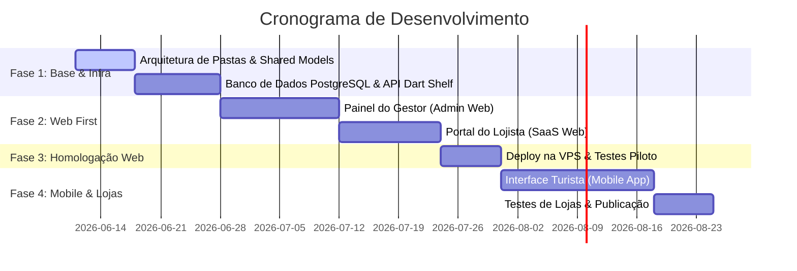

# Product Requirement Document (PRD) — Tô Na Rota 2026

## 1. Visão Geral do Produto
O **Tô Na Rota 2026** é um ecossistema digital composto por um Aplicativo Mobile (Turistas/Consumidores) e um Painel Web (Lojistas/Gestores). O objetivo é prover um guia comercial, agenda cultural, informações climáticas/de emergência e transmissão de câmeras ao vivo do litoral, operando sob um modelo de assinatura SaaS simplificado para comércios locais.

---

## 2. Objetivos e Metas (KPIs)
*   **Time-to-Market Rápido:** Lançamento estruturado sob o conceito *Web-First* para início imediato do povoamento comercial.
*   **Custo de Operação Mínimo:** Stack nativa de baixo consumo para viabilizar hospedagem em VPS de entrada na Hostinger.
*   **Engajamento de Lojistas:** Oferecer um portal intuitivo de autoatendimento para cadastro de vitrines digitais.

---

## 3. Stack Tecnológica Unificada

| Camada | Tecnologia | Detalhes / Papel no Ecossistema |
|---|---|---|
| **Front-End Mobile** | Flutter (Dart 3.x) | Compilação nativa para Android e iOS. |
| **Front-End Web** | Flutter Web (Dart 3.x) | Painel Administrativo e Portal do Lojista. |
| **Servidor Backend** | Dart (Shelf Framework) | Servidor de APIs REST leve e compilado nativamente. |
| **Banco de Dados** | PostgreSQL 15+ | Armazenamento relacional e indexação espacial de praias. |
| **Proxy & Cache** | Nginx | Proxy reverso para a API e servidor web para a build estática. |
| **Infraestrutura** | VPS Linux (Hostinger) | Servidor dedicado rodando binários nativos e PostgreSQL. |

---

## 4. Módulos e Funcionalidades Detalhadas

### A. Interface do Consumidor (Mobile App - Android & iOS)
1.  **Filtro por Balneário:** Seleção manual da praia ou município para regionalização automática de todo o conteúdo exposto.
2.  **Diretório de Categorias:** Listagem estruturada de comércios dividida em Gastronomia, Lazer, Hospedagem e Serviços.
3.  **Busca Avançada:** Pesquisa por palavras-chave (nome do local ou categoria de serviço).
4.  **Perfil do Estabelecimento:**
    *   *Nível Gratuito:* Nome, segmento comercial, endereço e telefone.
    *   *Nível Premium:* Liberação de galeria de fotos, botões rápidos (WhatsApp, Instagram, Mapa), carrossel de destaques na Home do Balneário e catálogo digital.
5.  **Mini Catálogo de Produtos (Apenas Premium):** Vitrine interna do estabelecimento contendo foto, título, descrição e preço de 20 a 30 itens.
6.  **Câmeras ao Vivo (Live Cams):** Player de vídeo integrado compatível com transmissões locais via HLS (HTTP Live Streaming) ou RTSP.
7.  **Agenda Cultural:** Feed cronológico de eventos locais e festividades associadas aos balneários.
8.  **Clima e Utilidade Pública:** Integração com APIs climáticas locais e diretório de emergência (Bombeiros, Polícia, UPAs, mecânicos locais e chaveiros).

### B. Portal do Estabelecimento (Web SaaS)
1.  **Cadastro & Perfil:** Gestão dos dados comerciais (CNPJ/CPF, contatos, mídias sociais e logomarca).
2.  **Gestão do Catálogo:** Interface simples para cadastrar, editar e excluir os produtos/serviços expostos na vitrine móvel.
3.  **Relatórios de Acesso:** Painel analítico exibindo a volumetria de visualizações da página, cliques em botões de ação e feedbacks/avaliações.
4.  **Controle de Cobrança (Fase MVP):** Notificações e faturamentos externos administrados de forma manual pela gestão do Tô Na Rota.

### C. Painel do Gestor (Admin Web)
1.  **Gestão de Balneários:** Cadastro e edição das praias e municípios cobertos, com vinculação das URLs de streaming das câmeras.
2.  **Moderação de Lojistas:** Aprovação de novos cadastros e upgrade/downgrade manual de níveis de plano (Gratuito vs Premium).
3.  **Gestão de Categorias:** Árvore estruturada de segmentos de comércio e serviços.
4.  **Espaço de Anunciantes:** Upload e gerenciamento da vigência temporal de mini banners rotativos exibidos no aplicativo.
5.  **Console Push Notification:** Painel para envio de alertas informativos e promocionais segmentados por balneário.

---

## 5. Requisitos Não Funcionais (RNFs)

### Segurança e Autenticação
*   **Autenticação por JWT (JSON Web Tokens):** Sessões seguras com tokens expiráveis para Lojistas e Administradores.
*   **Criptografia:** Senhas salvas com hash seguro (Argon2 ou BCrypt). Conexões 100% criptografadas via HTTPS (SSL provido pelo Let's Encrypt / Nginx).
*   **Rate Limiting:** Proteção básica contra ataques de força bruta e sobrecarga na API Dart Shelf.

### Performance e Otimização
*   **Processamento de Mídia:** Redimensionamento e compressão automática de fotos no servidor para otimizar o carregamento nos dispositivos móveis.
*   **Tempo de Resposta:** Consultas ao banco com tempo de resposta da API abaixo de 100ms.
*   **Cache:** Cache de dados estáticos (cidades, categorias e emergências) no próprio app para evitar requisições repetidas.

---

## 6. Estratégia de Testes Automatizados

1.  **Testes de Unidade (Backend & Shared):** Validação dos algoritmos de autenticação, parsing de modelos e regras de negócio essenciais no pacote `/shared` e no servidor.
2.  **Testes de Integração de API:** Testes automatizados executando requisições contra endpoints locais do Dart Shelf simulando cenários reais.
3.  **Testes de Widget (Frontend):** Testes de UI nos componentes principais (filtros de balneário, renderizador do catálogo) para evitar regressões visuais.

---

## 7. Cronograma e Fases de Lançamento

*   **Fase 1: Preparação de Base e Modelagem (Semanas 1 e 2):** Estruturação do monorepo, banco PostgreSQL e rotas básicas de autenticação na API Dart Shelf.
*   **Fase 2: Portal Web & Admin (Semanas 3 a 6):** Construção das ferramentas web que permitirão o cadastramento comercial imediato.
*   **Fase 3: Deploy VPS & Povoamento (Semana 7):** Hospedagem da aplicação na Hostinger VPS para início da coleta de dados comerciais.
*   **Fase 4: Aplicativo Mobile (Semanas 8 a 10):** Construção do frontend móvel nativo, integração com as câmeras ao vivo e agendas cadastradas na web.
*   **Fase 5: Lançamento Final (Semana 11):** Publicação do app na App Store e Google Play.
