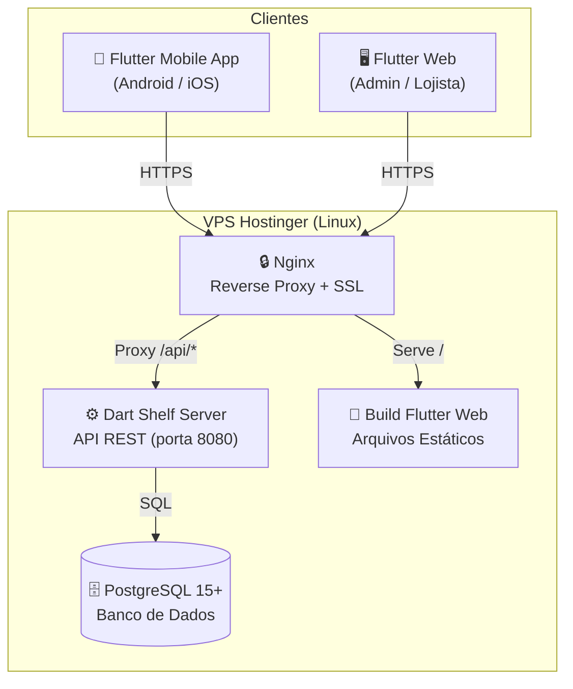
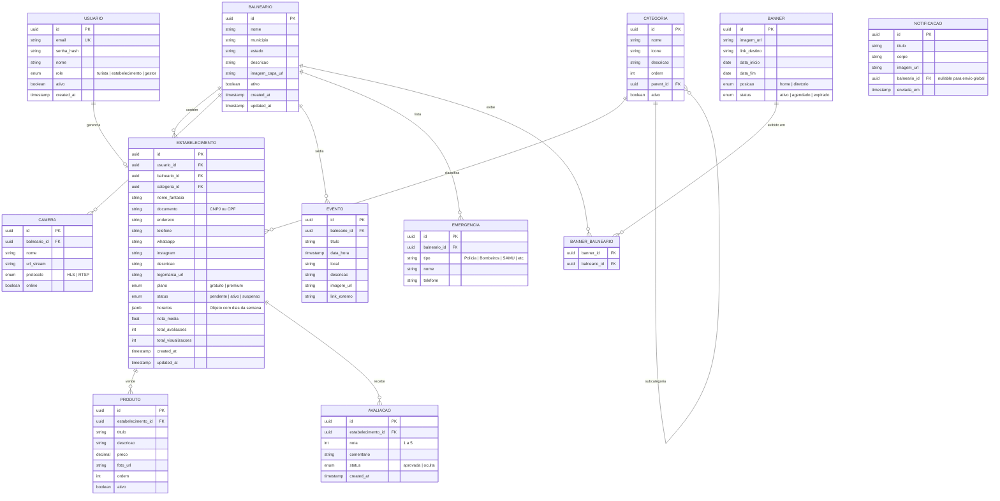
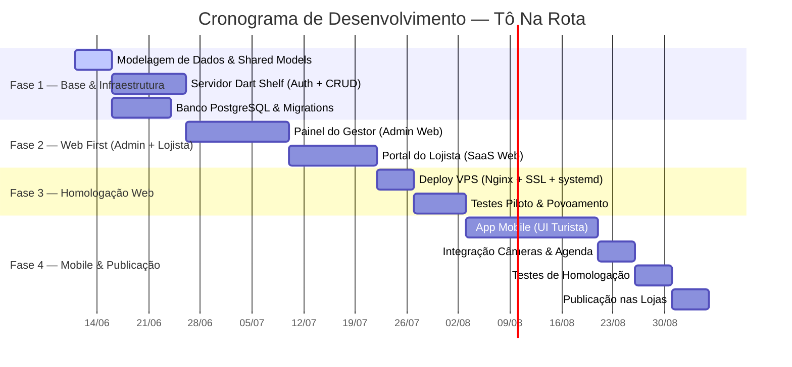

# Product Requirement Document (PRD)
## Ecossistema Digital — Tô Na Rota

| Campo | Valor |
|---|---|
| **Produto** | Guia Balneário Tô Na Rota |
| **Versão do Documento** | 1.0 |
| **Data de Criação** | 11 de Junho de 2026 |
| **Repositório** | [edercachoeira/tonarota-2026](https://github.com/edercachoeira/tonarota-2026) |
| **Modelo de Negócio** | SaaS Simplificado (Assinatura Comercial Recorrente) |
| **Público Alvo** | Turistas, Moradores Locais, Comerciantes e Prestadores de Serviço do Litoral |

---

## 1. Visão Geral do Produto

O **Tô Na Rota** é uma plataforma integrada de guia comercial e utilidade pública voltada para regiões litorâneas. O ecossistema é composto por três interfaces distintas que compartilham uma base de dados unificada:

1. **Aplicativo Mobile (Android & iOS):** Interface gratuita para turistas e moradores locais, oferecendo diretório de comércios, câmeras ao vivo das praias, agenda cultural, clima e telefones de emergência.
2. **Portal do Lojista (Flutter Web):** Painel self-service para que comerciantes cadastrem seus perfis, publiquem catálogos de produtos e acompanhem métricas de acesso.
3. **Painel Administrativo (Flutter Web):** Console centralizado de gestão para o operador da plataforma, com controle total sobre balneários, categorias, lojistas, anunciantes e notificações push.

A receita do projeto é gerada por assinaturas de planos comerciais (Gratuito vs. Premium) e pela venda de espaços publicitários (mini banners rotativos).

---

## 2. Objetivos e Métricas de Sucesso (KPIs)

| Objetivo | Métrica (KPI) | Meta Inicial |
|---|---|---|
| Velocidade de lançamento | Tempo até o primeiro lojista cadastrado no painel web | ≤ 8 semanas após início do desenvolvimento |
| Adoção comercial | Número de lojistas cadastrados na versão piloto | ≥ 30 lojistas no primeiro balneário |
| Conversão Premium | Taxa de upgrade de Gratuito para Premium | ≥ 15% dos lojistas ativos |
| Custo operacional | Custo mensal de infraestrutura VPS | ≤ R$ 60/mês (plano VPS Hostinger de entrada) |
| Engajamento do turista | Sessões mensais no app mobile após lançamento | ≥ 500 sessões/mês no primeiro trimestre |
| Satisfação do lojista | NPS (Net Promoter Score) coletado no portal | ≥ 7.0 |

---

## 3. Personas e Perfis de Usuário

### 3.1 Turista / Morador Local (Consumidor)
- **Quem é:** Pessoa visitando ou residindo em uma cidade litorânea.
- **Objetivo:** Encontrar rapidamente restaurantes, bares, hospedagens, serviços de emergência e programações culturais na região.
- **Comportamento:** Usa predominantemente o celular, muitas vezes com conexão móvel instável. Valoriza informações visuais (fotos, câmeras ao vivo) e acesso rápido a contatos (WhatsApp, telefone).
- **Nível de Acesso:** Público, sem necessidade de login.

### 3.2 Lojista / Comerciante (Estabelecimento)
- **Quem é:** Proprietário ou gerente de um comércio ou serviço localizado na região litorânea.
- **Objetivo:** Divulgar seu negócio para turistas com o menor esforço possível, manter seus dados atualizados e acompanhar o retorno da exposição.
- **Comportamento:** Acessa o portal web pelo computador ou celular para atualizar informações. Prefere interfaces simples e diretas.
- **Nível de Acesso:** Autenticado via login (e-mail + senha). Acesso restrito ao seu próprio perfil e catálogo.

### 3.3 Gestor / Administrador (Operador da Plataforma)
- **Quem é:** O operador comercial do Tô Na Rota, responsável por vender assinaturas, gerenciar o conteúdo e operar a plataforma.
- **Objetivo:** Controlar todos os aspectos da plataforma: aprovar cadastros, gerenciar balneários, moderar conteúdo, disparar notificações e acompanhar receita.
- **Nível de Acesso:** Autenticado com permissões totais (super admin).

---

## 4. Stack Tecnológica

> [!IMPORTANT]
> Este projeto substitui a stack legada do briefing original (PHP + MySQL + Apache) por uma arquitetura moderna unificada em Dart. Para detalhamento completo da decisão técnica, consulte o documento [technical_revision.md](setup/technical_revision.md).

| Camada | Tecnologia | Versão Mínima | Justificativa |
|---|---|---|---|
| **Linguagem** | Dart | 3.x | Linguagem única para frontend e backend, com compilação nativa AOT. |
| **Front-End Mobile** | Flutter | 3.x | Framework multiplataforma com compilação nativa para Android e iOS. |
| **Front-End Web** | Flutter Web | 3.x | Mesma base de código do mobile, renderizada como aplicação SPA no navegador. |
| **Backend / API** | Dart Shelf | latest | Framework HTTP minimalista e de alta performance para APIs REST. |
| **Banco de Dados** | PostgreSQL | 15+ | Relacional, robusto, com suporte a indexação espacial (PostGIS futuro) e JSON. |
| **Proxy Reverso** | Nginx | 1.24+ | Proxy reverso para API, servidor de arquivos estáticos e terminação SSL. |
| **Infraestrutura** | VPS Linux (Hostinger) | Ubuntu 22.04+ | Servidor dedicado com binários nativos, sem necessidade de containers. |

### 4.1 Diagrama de Arquitetura



### 4.2 Estrutura do Monorepo

O repositório é organizado como um monorepo Dart para maximizar o compartilhamento de código:

```
tonarota-2026/
├── lib/                    # Código Flutter (UI Mobile + Web)
│   ├── core/               # Tema, rotas, constantes, serviços HTTP
│   ├── features/           # Telas organizadas por feature
│   │   ├── home/           # Home com filtro de balneário
│   │   ├── directory/      # Diretório de categorias e busca
│   │   ├── establishment/  # Perfil do estabelecimento e catálogo
│   │   ├── livecams/       # Módulo de câmeras ao vivo
│   │   ├── events/         # Agenda cultural
│   │   ├── weather/        # Clima e utilidade pública
│   │   ├── admin/          # Painel do gestor (Flutter Web)
│   │   └── merchant/       # Portal do lojista (Flutter Web)
│   └── shared/             # Widgets e utilitários compartilhados
├── server/                 # API Backend em Dart Shelf
│   ├── bin/                # Ponto de entrada do servidor
│   ├── lib/
│   │   ├── routes/         # Handlers de rotas da API
│   │   ├── middleware/     # Auth JWT, rate limiting, CORS
│   │   ├── services/       # Lógica de negócio (auth, upload, etc.)
│   │   └── database/       # Conexão PostgreSQL, queries, migrations
│   └── test/               # Testes do servidor
├── shared/                 # Pacote Dart compartilhado (client + server)
│   └── lib/
│       ├── models/         # Classes de dados (Estabelecimento, Produto, etc.)
│       ├── validators/     # Regras de validação de formulários e dados
│       └── constants/      # Enums, constantes de negócio e de API
├── docs/                   # Documentação do projeto
│   ├── PRD.md              # Este documento
│   └── setup/              # Guias de ambiente e infraestrutura
├── android/                # Configurações nativas Android
├── ios/                    # Configurações nativas iOS
├── web/                    # Shell HTML do Flutter Web
├── test/                   # Testes do Flutter (widget + integração)
└── pubspec.yaml            # Dependências do projeto Flutter
```

---

## 5. Módulos e Funcionalidades Detalhadas

### 5.1 Módulo A — Interface do Consumidor (Mobile App)

| # | Funcionalidade | Descrição Detalhada | Prioridade |
|---|---|---|---|
| A1 | **Filtro por Balneário** | Tela de seleção manual da praia ou município. Ao escolher um balneário, todo o conteúdo do app (diretório, câmeras, agenda e emergências) é filtrado automaticamente para aquela região. O balneário selecionado fica salvo localmente para sessões futuras. | P0 (Essencial) |
| A2 | **Diretório de Categorias** | Listagem estruturada de estabelecimentos organizados por segmentos: **Gastronomia** (restaurantes, bares, lanchonetes), **Lazer** (passeios, aluguel de equipamentos), **Hospedagem** (pousadas, hotéis, casas de temporada) e **Serviços** (mecânicos, farmácias, mercados). Cada categoria exibe um ícone representativo e a contagem de estabelecimentos ativos. | P0 |
| A3 | **Busca Simples** | Campo de pesquisa textual global que filtra por nome do estabelecimento ou tipo de categoria. A busca opera sobre o conjunto de dados do balneário selecionado. Resultados exibidos em lista com nome, categoria e distância aproximada (se disponível). | P0 |
| A4 | **Perfil do Estabelecimento** | Página individual do comércio com dois níveis de exibição: | P0 |
|  |  | **Nível Gratuito:** Nome, segmento, endereço textual e telefone de contato. |  |
|  |  | **Nível Premium:** Tudo do Gratuito + galeria de até 10 fotos, descrição institucional completa, horários de funcionamento por dia da semana, botões de ação rápida (WhatsApp, Instagram, Google Maps), exibição no carrossel de destaques na Home do Balneário e acesso ao catálogo de produtos. |  |
| A5 | **Mini Catálogo de Produtos** | Vitrine digital interna ao perfil do estabelecimento (somente Premium). Limite de 20 a 30 itens por perfil. Cada item contém: foto do produto (comprimida automaticamente pelo servidor), título (máx. 80 caracteres), descrição curta (máx. 200 caracteres) e preço (valor numérico em R$). Layout em grid de cards responsivos. | P1 (Importante) |
| A6 | **Câmeras ao Vivo (Live Cams)** | Módulo de streaming de vídeo com player integrado. Cada balneário pode ter múltiplas câmeras cadastradas pelo gestor. O sistema suporta os protocolos **HLS** (HTTP Live Streaming) e **RTSP** (Real Time Streaming Protocol). O player exibe o nome da câmera, o balneário e indicador de status (online/offline). | P1 |
| A7 | **Agenda Cultural** | Feed cronológico de eventos locais, festas e programações culturais. Cada evento contém: título, data/hora, local, descrição, imagem de capa e link opcional para ingresso ou redes sociais. Filtrável por balneário e por período (hoje, esta semana, este mês). | P1 |
| A8 | **Clima e Utilidade Pública** | Duas subseções: (1) **Clima:** integração com API meteorológica externa exibindo temperatura atual, condição climática, previsão para os próximos 3 dias e condições do mar (quando disponível). (2) **Emergências:** lista estática de telefones úteis essenciais por balneário (Polícia, Bombeiros, SAMU, UPAs, guinchos, mecânicos 24h e chaveiros). | P1 |
| A9 | **Avaliação do Serviço** | Sistema básico de classificação: o turista atribui de 1 a 5 estrelas e opcionalmente um comentário textual (máx. 300 caracteres). A nota média é exibida no card do estabelecimento no diretório. Avaliações ficam visíveis publicamente. Moderação pelo gestor via painel admin. | P2 (Desejável) |
| A10 | **Espaço de Anunciantes** | Área visual dedicada na Home do Balneário e/ou entre listagens de categorias para exibição de mini banners rotativos (carrossel). Cada banner é uma imagem com link de redirecionamento opcional. Vigência temporal controlada pelo gestor. | P1 |

### 5.2 Módulo B — Portal do Estabelecimento (Flutter Web - SaaS)

| # | Funcionalidade | Descrição Detalhada | Prioridade |
|---|---|---|---|
| B1 | **Cadastro e Login** | Tela de registro com campos: CNPJ ou CPF, razão social ou nome fantasia, e-mail, senha, telefone e seleção do balneário de atuação. Login via e-mail + senha com JWT. Recuperação de senha por e-mail. | P0 |
| B2 | **Gestão de Perfil** | Dashboard para edição dos dados corporativos: nome de exibição, endereço completo, telefone, WhatsApp, Instagram, logomarca (upload de imagem com compressão automática), descrição institucional e horários de funcionamento (tabela por dia da semana com horário de abertura e fechamento). | P0 |
| B3 | **Gestão do Catálogo** | Interface CRUD (criar, ler, atualizar, excluir) para gerenciar os itens da vitrine digital. Cada item: foto (upload com preview), título, descrição e preço. Limite de 20–30 itens conforme plano. Reordenação por drag-and-drop. Disponível apenas para plano Premium. | P0 |
| B4 | **Relatórios de Acesso** | Painel analítico exibindo: total de visualizações do perfil (últimos 7, 30 e 90 dias), cliques nos botões de ação (WhatsApp, Instagram, Mapa), listagem de avaliações recebidas com nota e comentário. Gráficos simples de linha para tendência temporal. | P1 |
| B5 | **Informações do Plano** | Exibição do nível de plano atual (Gratuito ou Premium), listagem das funcionalidades liberadas vs. bloqueadas, e informação de contato do gestor para upgrade. No MVP, não há gateway de pagamento integrado; o controle de cobrança é manual e externo ao sistema. | P2 |

### 5.3 Módulo C — Painel do Gestor (Flutter Web - Admin)

| # | Funcionalidade | Descrição Detalhada | Prioridade |
|---|---|---|---|
| C1 | **Gestão de Balneários** | CRUD completo de praias e municípios cobertos pela plataforma. Campos: nome do balneário, município, estado, descrição, imagem de capa e lista de URLs de câmeras ao vivo vinculadas. Ativação/desativação de balneários para controle de lançamento piloto. | P0 |
| C2 | **Gestão de Estabelecimentos** | Listagem de todos os lojistas com filtros por balneário, status (pendente, ativo, suspenso) e nível de plano. Ações: aprovar cadastro, suspender conta, alterar nível de plano (Gratuito ↔ Premium), editar dados em nome do lojista, visualizar métricas. | P0 |
| C3 | **Gestão de Categorias** | Árvore hierárquica de segmentos comerciais. Exemplo: Gastronomia → Restaurantes, Bares, Lanchonetes. Cada categoria possui: nome, ícone (selecionável de uma biblioteca pré-definida), descrição e ordem de exibição. Permite criar, editar, reordenar e desativar categorias. | P0 |
| C4 | **Gestão de Usuários** | Controle de credenciais e permissões. Três níveis: **Turista** (sem login, acesso público), **Estabelecimento** (login, acesso ao portal do lojista) e **Gestor** (login, acesso total ao admin). Possibilidade de criar contas de gestor secundárias. | P0 |
| C5 | **Gestão de Anunciantes** | Interface para upload de banners (imagem + link de destino), definição da data de início e fim da veiculação, seleção dos balneários onde o banner será exibido e posição de exibição (Home ou Diretório). Listagem com status (ativo, agendado, expirado). | P1 |
| C6 | **Gestão da Agenda Cultural** | CRUD de eventos culturais associados a balneários. Campos: título, data/hora, local, descrição, imagem de capa, link externo, balneário vinculado. Ordenação cronológica automática. | P1 |
| C7 | **Gestão de Emergências** | Cadastro e manutenção da tabela de telefones úteis por balneário: Polícia, Bombeiros, SAMU, UPAs, guinchos, mecânicos 24h, chaveiros e outros. | P1 |
| C8 | **Console de Push Notifications** | Painel para composição e envio de mensagens push para os usuários do app mobile. Campos: título, corpo da mensagem, imagem opcional e segmentação por balneário. Histórico de notificações enviadas. | P2 |
| C9 | **Relatório de Vendas** | Listagem analítica das assinaturas ativas (lojistas Premium), receita mensal estimada, histórico de upgrades/downgrades e taxa de churn. No MVP, alimentado manualmente pelo gestor. | P2 |
| C10 | **Moderação de Avaliações** | Listagem de todas as avaliações enviadas pelos turistas, com filtro por estabelecimento e nota. Ações: aprovar, ocultar ou excluir avaliações inadequadas. | P2 |

---

## 6. Modelo de Dados (Entidades Principais)

O banco de dados PostgreSQL será estruturado com as seguintes entidades principais. A segmentação multi-tenant é realizada por meio do campo `balneario_id` presente em todas as tabelas relevantes.



---

## 7. Requisitos Não Funcionais (RNFs)

### 7.1 Segurança

| Requisito | Implementação | Detalhes |
|---|---|---|
| **Autenticação** | JWT (JSON Web Tokens) | Tokens com expiração de 24h para lojistas e 8h para gestores. Refresh tokens com rotação automática. |
| **Criptografia de Senhas** | Argon2id ou BCrypt | Senhas nunca armazenadas em texto plano. Hashing com salt único por usuário. |
| **Transporte Seguro** | HTTPS via Let's Encrypt | Certificados SSL gratuitos gerenciados pelo Certbot no Nginx. Redirecionamento forçado de HTTP → HTTPS. |
| **Rate Limiting** | Middleware Shelf | Limite de 100 req/min por IP em rotas públicas e 30 req/min em rotas de autenticação para mitigar força bruta. |
| **Validação de Entrada** | Pacote `/shared/validators` | Validação rigorosa de todos os campos no lado do servidor (além do cliente) para prevenir injeção SQL e XSS. |
| **CORS** | Middleware Shelf | Configuração restritiva permitindo apenas origens conhecidas (domínio do Flutter Web). |
| **Upload de Arquivos** | Validação de tipo MIME | Aceitar apenas formatos de imagem (JPEG, PNG, WebP). Limite de tamanho: 5MB por arquivo. |

### 7.2 Performance e Otimização

| Requisito | Meta | Implementação |
|---|---|---|
| **Tempo de Resposta API** | < 100ms (p95) | Queries SQL otimizadas com índices compostos; pool de conexões ao PostgreSQL. |
| **Processamento de Mídia** | Automático no upload | Redimensionamento de imagens para múltiplas resoluções (thumbnail 200px, card 600px, full 1200px) usando `package:image`. Compressão para WebP quando suportado. |
| **Cache no App** | Dados estáticos em disco | Listas de balneários, categorias e emergências cacheadas localmente no dispositivo com TTL de 24h para reduzir requisições em conexões instáveis. |
| **Compilação Backend** | Binário nativo AOT | `dart compile exe` para execução direta no Linux sem necessidade de VM Dart na VPS. Consumo estimado: < 50MB RAM em repouso. |
| **Lazy Loading** | Imagens e listas | Carregamento sob demanda das imagens de perfil e produtos. Paginação infinita no diretório de estabelecimentos (20 itens por página). |

### 7.3 Disponibilidade e Manutenção

| Requisito | Implementação |
|---|---|
| **Uptime** | Processo do servidor gerenciado via **systemd** com reinício automático em caso de falha (`Restart=always`). |
| **Backups** | PostgreSQL: `pg_dump` diário automatizado via cron, com retenção de 7 dias. Imagens: backup incremental do diretório de uploads. |
| **Logs** | Logs estruturados em JSON gravados em arquivo rotativo. Níveis: INFO, WARN, ERROR. |
| **Monitoramento** | Health check endpoint (`GET /api/health`) retornando status do servidor e do banco. |

---

## 8. Estratégia de Testes

### 8.1 Testes de Unidade

| Alvo | Escopo | Ferramenta |
|---|---|---|
| Pacote `shared/` | Validadores de formulário, serialização/deserialização de modelos, regras de negócio (ex: limite de itens no catálogo por plano). | `package:test` |
| Servidor (`server/`) | Lógica de autenticação (hash, geração e validação de JWT), serviços de processamento de imagem, queries de banco. | `package:test` |

### 8.2 Testes de Integração de API

| Cenário | Descrição |
|---|---|
| Fluxo de Autenticação | Registro → Login → Obtenção de Token → Acesso a Rota Protegida → Refresh Token → Logout. |
| CRUD de Estabelecimento | Criar perfil → Atualizar dados → Upload de logomarca → Listar no diretório → Desativar. |
| CRUD de Produto | Adicionar item ao catálogo → Editar preço → Reordenar → Excluir → Verificar limite do plano. |
| Permissões | Lojista tentando acessar rotas de admin (deve retornar 403). Gestor acessando rotas de lojista (deve funcionar). |

### 8.3 Testes de Widget (Frontend Flutter)

| Componente | O que é validado |
|---|---|
| Seletor de Balneário | Renderização da lista, seleção persiste entre sessões, filtragem do conteúdo. |
| Card de Estabelecimento | Exibição correta dos dados nos dois níveis (Gratuito vs Premium), botões de ação. |
| Formulário de Produto | Validação dos campos, preview de imagem, comportamento de envio com sucesso e erro. |
| Player de Câmera | Inicialização do player HLS, indicador de status online/offline, fallback de erro. |

---

## 9. Estratégia de Implantação (Web-First)

O plano de implantação segue duas etapas sequenciais obrigatórias:

### Fase 1 — Web First (Infraestrutura + Painel + Portal)
1. Publicação do banco de dados PostgreSQL na VPS.
2. Deploy da API Dart Shelf compilada como binário nativo.
3. Deploy do Painel Administrativo (Flutter Web) e do Portal do Lojista (Flutter Web).
4. **Objetivo:** Permitir que a equipe de gestão realize o povoamento comercial e execute testes piloto diretamente pelo navegador, antes de investir na versão mobile.

### Fase 2 — Mobile (App Android & iOS)
1. Após consolidação, estabilização e validação dos dados na interface Web, inicia-se a compilação e homologação dos apps nativos.
2. Publicação nas lojas oficiais (Google Play Store e Apple App Store).
3. **Pré-requisito:** Contas de desenvolvedor corporativas ativas na Google Play e na Apple Developer Academy.

---

## 10. Cronograma Faseado



| Fase | Duração Estimada | Entregável Principal |
|---|---|---|
| **Fase 1** | ~2 semanas | Banco de dados, modelos compartilhados e API funcional com autenticação. |
| **Fase 2** | ~4 semanas | Painel do gestor e portal do lojista totalmente operacionais no navegador. |
| **Fase 3** | ~2 semanas | Aplicação web rodando na VPS Hostinger com SSL, pronta para povoamento real. |
| **Fase 4** | ~4 semanas | App mobile publicado na Google Play e Apple App Store. |

---

## 11. Escopo Explicitamente Excluído (MVP → V2)

Os seguintes itens ficam **fora do escopo** desta versão e são candidatos para a versão 2.0:

| Item Excluído | Motivo |
|---|---|
| Geofencing / GPS em segundo plano | Alto consumo de bateria e complexidade de permissões mobile. |
| Sugestões inteligentes (IA preditiva) | Requer volume de dados significativo antes de ser efetivo. |
| Gateway de pagamento integrado | Assinaturas gerenciadas manualmente no MVP para reduzir complexidade e custos de integração. |
| Página automática de planos com assinatura recorrente | Dependente do gateway de pagamento. |
| Sistema de avaliação complexo (com fotos, respostas do lojista) | MVP possui apenas nota + comentário simples. |
| Chat entre turista e lojista | Comunicação via WhatsApp é suficiente no MVP. |
| Modo offline completo | Cache de dados estáticos apenas. Sincronização offline-first não é escopo do MVP. |

---

## 12. Glossário

| Termo | Definição |
|---|---|
| **Balneário** | Praia, município ou região litorânea cadastrada na plataforma. |
| **Estabelecimento** | Comércio, serviço ou ponto de interesse registrado por um lojista. |
| **Lojista** | Usuário autenticado que gerencia um ou mais estabelecimentos. |
| **Gestor** | Operador da plataforma com permissões administrativas totais. |
| **Turista** | Usuário final do aplicativo mobile (sem necessidade de cadastro). |
| **Premium** | Nível de plano pago com funcionalidades expandidas. |
| **Live Cam** | Câmera de transmissão ao vivo posicionada em uma praia ou ponto turístico. |
| **SaaS** | Software as a Service — modelo de distribuição de software por assinatura. |
