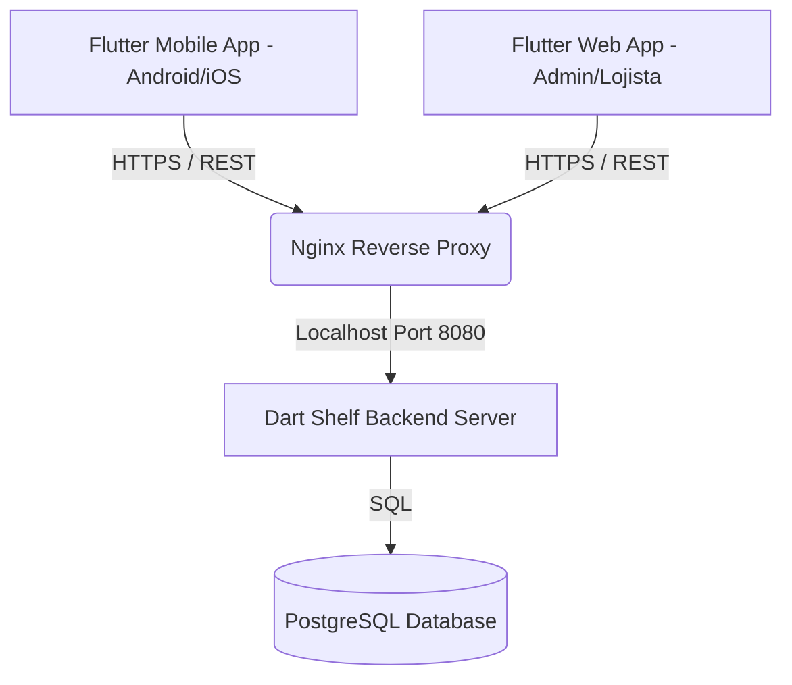

# Especificação Técnica Revisada: Tô Na Rota 2026

Este documento substitui as diretrizes legadas do briefing (PHP + MySQL + Apache) por uma arquitetura moderna unificada em **Dart/Flutter**, otimizada para implantação self-hosted em uma VPS Linux na Hostinger.

---

## 1. Stack Tecnológica Unificada



*   **Linguagem Unificada:** Dart 3.x para toda a aplicação (Frontend e Backend).
*   **Interface do Usuário:** Flutter (Mobile para turistas, Web para o portal do lojista e painel administrativo).
*   **Servidor Backend:** Dart com framework **Shelf** (leve, robusto, excelente para APIs REST RESTful rápidas e com consumo mínimo de memória).
*   **Banco de Dados:** PostgreSQL 15+ (relacional, performático, ideal para consultas espaciais e dados estruturados).
*   **Servidor Web e Proxy:** Nginx (usado como proxy reverso para a API e servidor dos arquivos estáticos do Flutter Web).

---

## 2. Estrutura do Projeto Monorepo (Recomendado)

Para viabilizar o compartilhamento total de código (modelos de dados e validações), estruturaremos o repositório como um monorepo Dart:

*   [`/lib`](file:///e:/xampp/htdocs/tonarota-2026/lib) / [`/web`](file:///e:/xampp/htdocs/tonarota-2026/web) / [`/android`](file:///e:/xampp/htdocs/tonarota-2026/android): Diretórios da aplicação Flutter Web e Mobile.
*   `/server`: Diretório contendo a API do servidor em Dart Shelf.
*   `/shared`: Pacote Dart compartilhado que conterá as classes de dados (ex: `Estabelecimento`, `Produto`, `Usuario`) e validações de negócios utilizadas tanto pelo cliente quanto pelo servidor.

---

## 3. Vantagens da API em Dart para Self-Hosting

1.  **Consumo Mínimo de Recursos:** O Dart compila para código de máquina nativo (AOT compilation). O servidor backend gerado rodará na VPS consumindo pouquíssima memória RAM (normalmente menos de 50MB em repouso), permitindo o uso de planos de VPS mais acessíveis da Hostinger.
2.  **Zero Duplicação de Modelos:** Uma alteração nas propriedades de uma entidade (ex: adicionar um campo no modelo `Estabelecimento`) é declarada apenas uma vez no pacote `/shared` e refletida instantaneamente tanto no backend quanto no frontend Flutter.
3.  **Segurança de Tipos (Type Safety):** Menos bugs em tempo de execução devido à validação estática do compilador Dart.
4.  **Facilidade de Manutenção:** Apenas um ecossistema para atualizar, debugar e testar.

---

## 4. Estratégia de Deploy na VPS Hostinger

A VPS hospedará toda a stack de maneira otimizada:

### Banco de Dados PostgreSQL
*   Instalado diretamente no Linux ou rodando em um container Docker isolado.
*   Configurado com backups periódicos automatizados.

### Servidor de API (Dart Shelf)
*   Compilado localmente ou na VPS para um binário Linux nativo:
    ```bash
    dart compile exe bin/server.dart -o bin/server
    ```
*   Configurado para rodar como um serviço do sistema (**systemd**), garantindo reinicialização automática caso ocorra alguma falha ou reinício do servidor VPS.

### Servidor Web (Nginx)
*   **Proxy Reverso:** Redirecionará requisições do subdomínio `api.seu-dominio.com` para a porta local do servidor Dart (ex: `:8080`).
*   **Hospedagem Web:** Servirá o build estático de produção do Flutter Web (`build/web`) em `seu-dominio.com` de maneira extremamente veloz.
*   **SSL Gratuito:** Certificados HTTPS automáticos via Let's Encrypt / Certbot.
