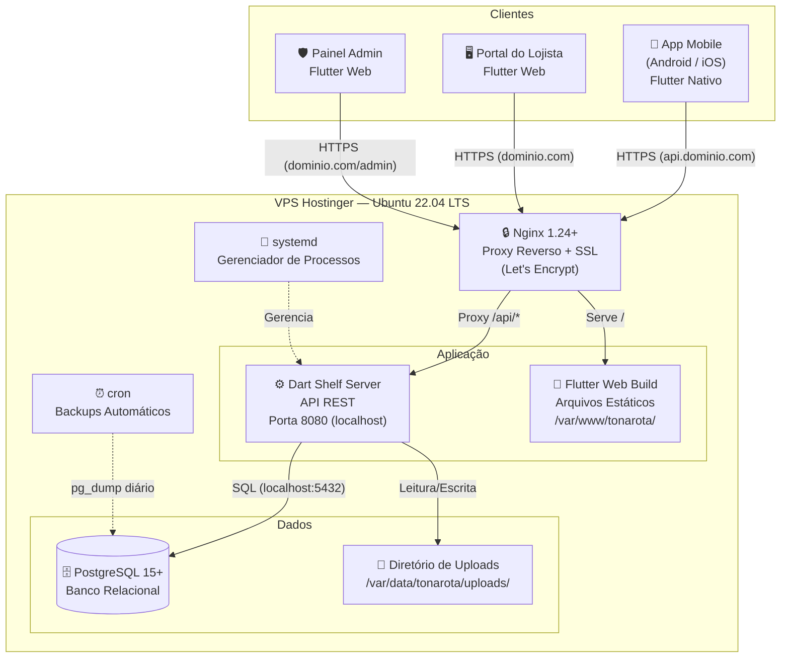

# Especificação Técnica Revisada — Tô Na Rota

| Campo | Valor |
|---|---|
| **Documento** | Revisão Técnica — Migração de Stack |
| **Versão** | 1.0 |
| **Data** | 11 de Junho de 2026 |
| **Contexto** | Substituição da stack legada PHP + MySQL + Apache por Dart + PostgreSQL + Nginx |

---

## 1. Contexto da Revisão

O briefing original do projeto (gerado a partir do contrato comercial) especificava a seguinte stack legada:

| Componente | Briefing Original | Status |
|---|---|---|
| Linguagem Backend | PHP 8.0+ | ❌ **Substituído** |
| Banco de Dados | MySQL 8.0+ | ❌ **Substituído** |
| Servidor Web | Apache (com mod_rewrite e .htaccess) | ❌ **Substituído** |
| Processamento de Imagens | Biblioteca GD (PHP) | ❌ **Substituído** |
| E-mail | Função `mail()` nativa + PEAR::Mail | ❌ **Substituído** |
| Abstração de BD | PEAR::MDB2 | ❌ **Substituído** |
| Front-End Mobile | Framework híbrido não especificado | ❌ **Substituído** |

**Motivo da substituição:** A decisão de desenvolver o projeto inteiramente em Flutter elimina a necessidade de uma API PHP separada. A linguagem Dart (base do Flutter) possui um ecossistema maduro para desenvolvimento de servidores backend, permitindo uma arquitetura unificada onde frontend e backend compartilham a mesma linguagem, os mesmos modelos de dados e as mesmas regras de validação.

---

## 2. Stack Tecnológica Adotada

### 2.1 Visão Geral

| Camada | Tecnologia Adotada | Substitui | Justificativa da Troca |
|---|---|---|---|
| **Linguagem** | Dart 3.x | PHP 8.0 | Linguagem única para frontend e backend. Compilação nativa AOT para binários de alta performance. |
| **Backend / API** | Dart Shelf | Apache + PHP | Framework HTTP minimalista. Sem necessidade de interpretador, roda como binário nativo do Linux. |
| **Banco de Dados** | PostgreSQL 15+ | MySQL 8.0 | Suporte nativo a UUID, JSONB, indexação full-text, extensão PostGIS (futuro). Licença mais permissiva. |
| **Proxy Reverso** | Nginx | Apache | Performance superior para servir arquivos estáticos e proxy reverso. Configuração declarativa e simples. |
| **Processamento de Imagens** | `package:image` (Dart) | Biblioteca GD (PHP) | Biblioteca nativa em Dart para redimensionamento, compressão e conversão de formatos (JPEG, PNG, WebP). |
| **E-mail** | `package:mailer` (Dart) | `mail()` + PEAR::Mail | Suporte a SMTP autenticado, TLS e templates HTML. Mais confiável que a função `mail()` nativa do PHP. |
| **Abstração de BD** | Driver PostgreSQL nativo (`package:postgres`) | PEAR::MDB2 | Conexão direta, tipada e segura ao PostgreSQL, sem abstração intermediária pesada. |
| **Front-End Mobile** | Flutter (Dart 3.x) | Não especificado | Framework multiplataforma com compilação nativa real para Android e iOS. |
| **Front-End Web** | Flutter Web (Dart 3.x) | PHP + HTML/CSS/JS | SPA renderizada pelo mesmo código do mobile, garantindo consistência de UI e compartilhamento de lógica. |

### 2.2 Diagrama de Arquitetura Completo



---

## 3. Estrutura do Monorepo

Para maximizar o compartilhamento de código entre frontend e backend, o repositório é organizado como um monorepo Dart:

```
tonarota-2026/
│
├── shared/                          # 📦 Pacote Dart compartilhado (usado pelo client E server)
│   ├── pubspec.yaml
│   └── lib/
│       ├── models/                  # Classes de dados serializáveis
│       │   ├── balneario.dart
│       │   ├── estabelecimento.dart
│       │   ├── produto.dart
│       │   ├── usuario.dart
│       │   ├── evento.dart
│       │   ├── camera.dart
│       │   ├── avaliacao.dart
│       │   ├── banner_ad.dart
│       │   └── emergencia.dart
│       ├── validators/              # Regras de validação de campos
│       │   ├── email_validator.dart
│       │   ├── documento_validator.dart   # CPF/CNPJ
│       │   └── produto_validator.dart
│       ├── constants/               # Enums e constantes de negócio
│       │   ├── plano_type.dart      # enum: gratuito, premium
│       │   ├── user_role.dart       # enum: turista, estabelecimento, gestor
│       │   └── api_endpoints.dart   # Caminhos das rotas da API
│       └── dto/                     # Data Transfer Objects para requisições/respostas
│           ├── login_request.dart
│           ├── login_response.dart
│           └── paginated_response.dart
│
├── server/                          # ⚙️ API Backend em Dart Shelf
│   ├── pubspec.yaml
│   ├── bin/
│   │   └── server.dart              # Ponto de entrada (main)
│   ├── lib/
│   │   ├── config/                  # Variáveis de ambiente, configuração do banco
│   │   │   ├── env.dart
│   │   │   └── database.dart
│   │   ├── middleware/              # Middlewares HTTP
│   │   │   ├── auth_middleware.dart      # Validação de JWT
│   │   │   ├── cors_middleware.dart
│   │   │   ├── rate_limit_middleware.dart
│   │   │   └── logger_middleware.dart
│   │   ├── routes/                  # Handlers de rotas agrupados por recurso
│   │   │   ├── auth_routes.dart         # POST /api/auth/login, /register, /refresh
│   │   │   ├── balneario_routes.dart
│   │   │   ├── estabelecimento_routes.dart
│   │   │   ├── produto_routes.dart
│   │   │   ├── evento_routes.dart
│   │   │   ├── camera_routes.dart
│   │   │   ├── avaliacao_routes.dart
│   │   │   ├── banner_routes.dart
│   │   │   ├── emergencia_routes.dart
│   │   │   ├── upload_routes.dart       # POST /api/upload/image
│   │   │   └── health_routes.dart       # GET /api/health
│   │   ├── services/                # Lógica de negócio
│   │   │   ├── auth_service.dart        # Hash, JWT, refresh tokens
│   │   │   ├── image_service.dart       # Redimensionamento e compressão
│   │   │   ├── email_service.dart       # SMTP via package:mailer
│   │   │   └── notification_service.dart
│   │   └── database/                # Camada de acesso a dados
│   │       ├── connection_pool.dart
│   │       ├── migrations/          # Scripts SQL versionados
│   │       │   ├── 001_initial_schema.sql
│   │       │   └── 002_seed_categorias.sql
│   │       └── repositories/       # Queries tipadas por entidade
│   │           ├── balneario_repository.dart
│   │           ├── estabelecimento_repository.dart
│   │           ├── produto_repository.dart
│   │           └── usuario_repository.dart
│   └── test/                        # Testes do servidor
│       ├── auth_test.dart
│       ├── estabelecimento_test.dart
│       └── integration/
│           └── api_integration_test.dart
│
├── lib/                             # 📱🖥️ Flutter App (Mobile + Web)
│   ├── main.dart
│   ├── core/
│   │   ├── theme/                   # Design system, cores, tipografia
│   │   ├── router/                  # GoRouter com guards de perfil
│   │   ├── constants/               # Configurações do app
│   │   └── services/
│   │       ├── api_client.dart      # Cliente HTTP para comunicação com a API
│   │       └── storage_service.dart # Cache local (SharedPreferences / Hive)
│   ├── features/
│   │   ├── home/                    # Home com seleção de balneário e destaques
│   │   ├── directory/               # Diretório de categorias e busca
│   │   ├── establishment/           # Perfil do estabelecimento e catálogo
│   │   ├── livecams/                # Player de câmeras ao vivo
│   │   ├── events/                  # Agenda cultural
│   │   ├── weather/                 # Clima e telefones de emergência
│   │   ├── ratings/                 # Avaliações de turistas
│   │   ├── auth/                    # Login/registro (lojista/gestor)
│   │   ├── merchant/                # Portal do lojista (Flutter Web)
│   │   │   ├── dashboard/
│   │   │   ├── profile/
│   │   │   ├── catalog/
│   │   │   └── reports/
│   │   └── admin/                   # Painel do gestor (Flutter Web)
│   │       ├── dashboard/
│   │       ├── balnearios/
│   │       ├── estabelecimentos/
│   │       ├── categorias/
│   │       ├── anunciantes/
│   │       ├── agenda/
│   │       ├── emergencias/
│   │       ├── usuarios/
│   │       └── notificacoes/
│   └── shared/                      # Widgets reutilizáveis do Flutter
│       ├── widgets/
│       └── extensions/
│
├── test/                            # Testes Flutter (widget + integração)
├── android/                         # Configurações nativas Android
├── ios/                             # Configurações nativas iOS
├── web/                             # Shell HTML do Flutter Web
├── docs/                            # Documentação do projeto
├── pubspec.yaml                     # Dependências Flutter
├── .gitignore
└── README.md
```

---

## 4. Comparativo de Requisitos: Briefing Original vs. Stack Adotada

A tabela abaixo mapeia cada requisito técnico listado na seção 7 do briefing original e mostra como ele é atendido pela nova stack:

| Requisito Original (Briefing) | Solução Adotada | Notas |
|---|---|---|
| PHP 8.0+ | Dart 3.x + Shelf | Eliminado. API escrita inteiramente em Dart, compilada para binário nativo. |
| MySQL 8.0+ | PostgreSQL 15+ | Banco mais robusto com suporte nativo a UUID, JSONB e extensões espaciais (PostGIS). |
| Biblioteca GD (redimensionamento de imagens) | `package:image` (Dart) | Mesma funcionalidade (resize, crop, compressão) executada nativamente em Dart, sem dependência de extensão PHP. |
| Função `mail()` nativa | `package:mailer` (Dart) | Envio de e-mail via SMTP autenticado com suporte a TLS, HTML templates e anexos. Mais confiável e auditável. |
| PEAR::MDB2 (abstração de BD) | `package:postgres` (Dart) | Conexão direta ao PostgreSQL com prepared statements, tipagem forte e pool de conexões. |
| PEAR::Mail | `package:mailer` (Dart) | Mesma substituição do item `mail()`. |
| Apache com mod_rewrite e .htaccess | Nginx com proxy reverso | Nginx é mais leve, mais rápido para conteúdo estático e mais simples de configurar como reverse proxy. |
| Contas Google Play Store e Apple Developer | Mantido sem alteração | Pré-requisito para publicação dos apps compilados pelo Flutter. |

---

## 5. Vantagens Consolidadas da Nova Arquitetura

### 5.1 Para o Desenvolvimento

1. **Linguagem Única (Dart):** O mesmo desenvolvedor pode trabalhar no app mobile, no painel web e no servidor backend sem trocar de linguagem. Isso reduz drasticamente a curva de aprendizado e o tempo de onboarding.

2. **Zero Duplicação de Modelos:** Uma alteração no modelo `Estabelecimento` (ex: adicionar campo `instagram`) é feita uma única vez no pacote `/shared/lib/models/estabelecimento.dart` e é automaticamente refletida tanto nas telas do Flutter quanto nas rotas da API.

3. **Validação Compartilhada:** Regras como "CNPJ deve ter 14 dígitos" ou "preço não pode ser negativo" são escritas uma vez em `/shared/lib/validators/` e executadas tanto no formulário do app quanto na validação do servidor — sem divergência.

4. **Segurança de Tipos (Type Safety):** O compilador Dart detecta erros de tipo em tempo de compilação, prevenindo categorias inteiras de bugs que seriam detectados apenas em produção com PHP.

### 5.2 Para a Operação (VPS Hostinger)

1. **Consumo Mínimo de RAM:** O servidor Dart compilado para binário nativo (AOT) consome tipicamente **30–50MB de RAM** em repouso, permitindo o uso de planos VPS de entrada da Hostinger (1–2GB RAM) com folga para o PostgreSQL e o Nginx.

2. **Sem Interpretador no Servidor:** Diferente de PHP (que requer php-fpm, extensões, PEAR), o servidor Dart é um único executável binário. Não há dependência de runtime, interpretador ou extensões para instalar/atualizar na VPS.

3. **Deploy Simples:** O deploy consiste em: (1) transferir o binário compilado para a VPS, (2) reiniciar o serviço systemd, (3) transferir o build web estático para o Nginx. Três comandos.

4. **Facilidade de Manutenção:** Atualizações de segurança e novas features são compiladas localmente e transferidas como um único arquivo executável. Sem necessidade de gerenciar versões de PHP, extensões ou pacotes PEAR na VPS.
